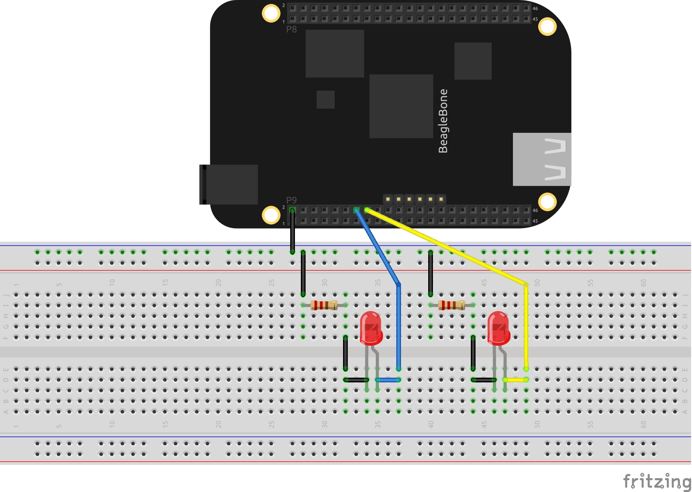
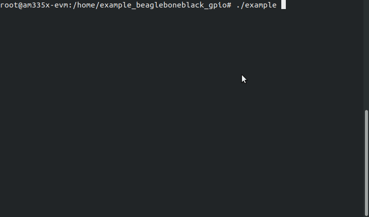

# BeagleBone Black GPIO

Uma biblioteca construída para facilitar o acesso à GPIO da BeagleBone Black, desenvolvida em C++.

<p>
    
    
    
</p>

## Descrição

Em placas de desenvolvimento microcontroladas, especialmente as voltadas para iniciantes ou para o público maker (como o Arduino), o acesso a GPIO - seja para receber ou emitir sinais - é simplificado por meio de funções tais como: [digitalWrite](https://www.arduino.cc/reference/en/language/functions/digital-io/digitalwrite/), [pinMode](https://www.arduino.cc/reference/en/language/functions/digital-io/pinmode/), [analogRead](https://www.arduino.cc/reference/en/language/functions/analog-io/analogread/), entre outras.

No entanto, quanto se passa para ambientes microprocessados (isto é, baseados em um sistema operacional), tal processo fica bem mais complicado, pois é necessário acessar os [drivers de dispositivo](https://www.apriorit.com/dev-blog/195-simple-driver-for-linux-os) do sistema. 

No caso do Linux, tais drivers se acessam como se acessa um arquivo (com o [FILE](https://www.programiz.com/c-programming/c-file-input-output) em C, por exemplo). Ainda assim, é necessário que o desenvolvedor organize grandes blocos de código em funções, para manter o código limpo; gastando tempo.

Por conta disso, resolvi criar uma biblioteca, em C++, que facilita a o acesso à GPIO de uma placa microprocessada, baseada em Linux. Nesse caso, a placa é a BeagleBone Black e a biblioteca foi baseada no padrão do Arduino: procurei adaptar o nome das funções de modo que o desenvolvedor se sinta familiarizado.

Esse projeto também é um desafio pessoal, e um exercício do uso da linguagem C++ em Linux embarcado, visando a manipulação de drivers de dispositivo.

Essa é uma biblioteca simples, como poucas funções. Pretendo, no futuro, adicionar mais funcionalidades, como [PWM](http://software-dl.ti.com/processor-sdk-linux/esd/docs/06_00_00_07/linux/Foundational_Components_Kernel_Drivers.html#pwm), [SPI](http://software-dl.ti.com/processor-sdk-linux/esd/docs/06_00_00_07/linux/Foundational_Components_Kernel_Drivers.html#spi), [I2C](http://software-dl.ti.com/processor-sdk-linux/esd/docs/06_00_00_07/linux/Foundational_Components_Kernel_Drivers.html#i2c) e outros recursos.

## Requisitos

- Placa de desenvolvimento [BeagleBone Black](https://beagleboard.org/black)
- [SDK Texas Instruments](http://software-dl.ti.com/processor-sdk-linux/esd/docs/06_00_00_07/linux/index.html)
> Aqui foi usada a versão 06_00_00_07.
- Sistema de arquivos _Arago-base_ instalado na placa
> Pois foi onde os testes foram realizados.

## Como usar

> Para se certificar sobre quais pinos podem ser usados para quais funções (digitais, analógicos, etc.), consulte a pinagem oficial, logo abaixo.


### _digital.hpp_

```cpp
//pinMode: habilita o pino e define o seu sentido (entrada/saída) 
pinMode(50, OUTPUT);

//digitalWrite: escreve no pino o sinal requerido (ligado/desligado)
digitalWrite(50, 1);

//unexport_gpio: após o término da aplicação, os drivers dos GPIOs ainda continuam habilitados. Para desligá-los, é necessário desativá-los.
unexport_gpio(50);
```

### _analog.hpp_

```cpp
//analogRead: lê um sinal analógico (de 0 a 4096)
int value = analogRead(0);
>> 726
```

### _utils.hpp_

```cpp
//delay: função delay do arduino, em segundos (aceita valores decimais também)
delay(1);
delay(0.5);

//defining_sigaction: função específica para lidar com a captura de interrupções (como o Ctrl+C). Necessária para o exemplo a seguir.
defining_sigaction();
```

## Demonstração

Para demonstrar a utilização dessa biblioteca, foi desenvolvido um [exemplo](example/), que consiste em um circuito de pisca leds alternados.

O funcionamento da aplicação é o seguinte: separou-se o programa em duas threads, de modo que uma é responsável pelo loop da piscagem dos leds, e a outra é responsável pela captura do sinal de interrupção (SIGINT). Se isso acontecer, um código é executado, desativando a GPIO e encerrando o programa.

Abaixo consta uma porção do código [main.cpp](example/main.cpp) (confira-o para mais detalhes).

```cpp
int main(){
    int led1 = 50;
    int led2 = 51;

    thread t1(main_loop, led1, led2);
    thread t2(sigint_handler, led1, led2);

    t1.join();
    t2.join();

    return 0;
}
```

O esquemático do circuito é apresentado abaixo:



Funcionamento do circuito:


Console




## Para saber mais

Se você quiser saber mais sobre a área de Linux embarcado, confira [este trabalho](https://github.com/felipegarcia99/Curso-de-Linux-Embarcado), do mesmo autor, acerca do processo de desenvolvimento de um sistema embarcado baseado em Linux (em português brasileiro).

## Licença

MIT